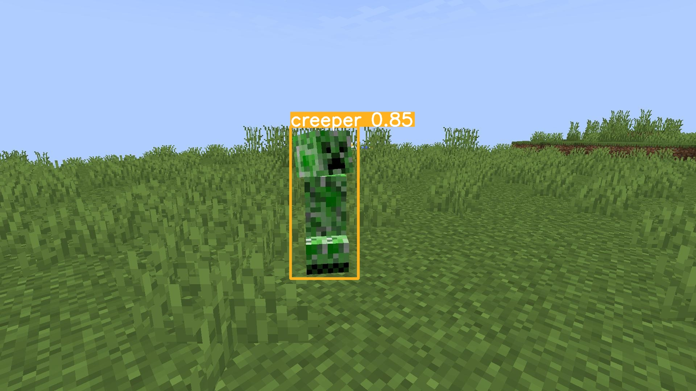
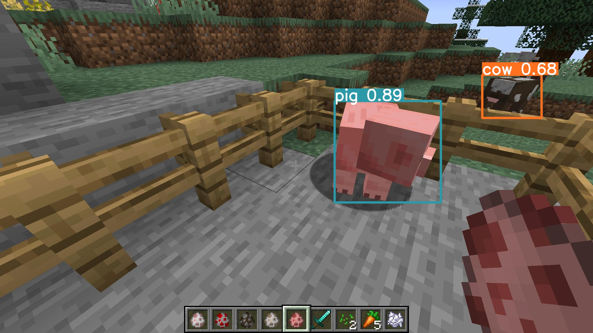

<div align="center">

# 🎮 Minecraft Mob Detection: FCOS vs YOLO

### Comparative Analysis of Modern Object Detection Architectures on a Gaming Dataset

[](https://www.python.org/)
[](https://pytorch.org/)
[](https://github.com/open-mmlab/mmdetection)
[](LICENSE)



[About](#about-the-project) •
[Results](#results) •
[Installation](#installation) •
[Usage](#usage) •
[Dataset](#dataset)

> TL;DR:  
> YOLOv8 delivers ~80% higher FPS, while FCOS keeps Precision +0.21 above YOLO.  
> Use YOLO for streams and FCOS for accuracy-critical analytics. [`metrics_comparison.csv`](./artifacts/metrics/metrics_comparison.csv)

</div>

---

## About the Project

Comprehensive study and comparison of two state-of-the-art object detection approaches using the Minecraft game world:

<table>
<tr>
<td width="50%">

### 🔵 FCOS
**Fully Convolutional One-Stage**
- Anchor-free architecture
- MMDetection framework
- High precision (Precision 0.87)
- Fewer false positives
- ~50 FPS

</td>
<td width="50%">

### 🟢 YOLOv8
**You Only Look Once v8**
- One-stage detector
- Ultralytics framework
- High mAP (0.51 @ 0.5:0.95)
- Excellent inference speed
- ~90 FPS

</td>
</tr>
</table>

### 🎯 Detection of 17 Minecraft Mob Classes

```python
CLASSES = [
    'bee', 'chicken', 'cow', 'creeper', 'enderman', 'fox', 'frog', 'ghast',
    'goat', 'llama', 'pig', 'sheep', 'skeleton', 'spider', 'turtle', 'wolf', 'zombie'
]
```

---

## Features

- 🔍 **Exploratory Data Analysis (EDA)** — class distribution visualization, object size statistics
- 🔄 **Multi-format Conversion** — Pascal VOC XML → COCO JSON / YOLO TXT
- 🏋️ **Fine-tuning of Two Architectures** — FCOS (ResNet-50) and YOLOv8s with full logging
- 📊 **Unified Metrics System** — mAP, Precision, Recall, F1, FPS
- 📈 **Results Visualization** — comparative plots, confusion matrices
- 🎥 **Video Inference** — real-time detection on video streams
- 💾 **Reproducibility** — all checkpoints, configs, and logs preserved

---

## Results

<div align="center">

### 🎯 Detection Example



*Model inference on a test image*

---

### 📊 Comparative Metrics Table

Testing on **155 images** of the Minecraft game dataset

</div>

<table align="center">
<tr>
<th>Metric</th>
<th>🔵 FCOS</th>
<th>🟢 YOLO</th>
<th>Difference</th>
<th>Winner</th>
</tr>
<tr>
<td><b>mAP@0.5:0.95</b></td>
<td>0.4510</td>
<td><b>0.5125</b></td>
<td>+0.0615</td>
<td>🟢 YOLO <i>(+13.6%)</i></td>
</tr>
<tr>
<td><b>mAP@0.5</b></td>
<td>0.6940</td>
<td><b>0.7507</b></td>
<td>+0.0567</td>
<td>🟢 YOLO <i>(+8.2%)</i></td>
</tr>
<tr>
<td><b>Precision</b></td>
<td><b>0.8696</b></td>
<td>0.6594</td>
<td>+0.2102</td>
<td>🔵 FCOS <i>(+31.9%)</i></td>
</tr>
<tr>
<td><b>Recall</b></td>
<td><b>0.8547</b></td>
<td>0.7051</td>
<td>+0.1496</td>
<td>🔵 FCOS <i>(+21.2%)</i></td>
</tr>
<tr>
<td><b>F1-score</b></td>
<td><b>0.8621</b></td>
<td>0.6815</td>
<td>+0.1806</td>
<td>🔵 FCOS <i>(+26.5%)</i></td>
</tr>
<tr>
<td><b>FPS</b></td>
<td>~50</td>
<td><b>~90</b></td>
<td>+40</td>
<td>🟢 YOLO <i>(+80%)</i></td>
</tr>
</table>

<br>

<div align="center">

### 💡 Key Conclusions

</div>

<table>
<tr>
<td width="50%" align="center">

### ⚡ YOLO — for Real-Time

**When to use:**
- 🎮 Live gameplay analysis
- 📹 Stream processing
- ⏱️ Real-time tasks
- 🎯 High mAP required

**Advantages:**
- Speed: **90 FPS** (+80%)
- Best mAP: **0.51** (+13.6%)
- Fast inference

</td>
<td width="50%" align="center">

### 🎯 FCOS — for Precision

**When to use:**
- 🔬 Accurate analytics
- 📊 Post-processing pipelines
- ✅ Minimum false positives
- 📈 Detection recall is critical

**Advantages:**
- Precision: **0.87** (+31.9%)
- Recall: **0.85** (+21.2%)
- F1-score: **0.86** (+26.5%)

</td>
</tr>
</table>

---

## Model Training

<details>
<summary><b>🔵 FCOS Training Pipeline</b></summary>

```python
# Configuration in configs/fcos/fcos_minecraft.py
# Base model: FCOS with ResNet-50 backbone

# Main parameters:
- Pre-trained on COCO Dataset
- Learning rate: 0.001
- Batch size: 8
- Epochs: 12
- Optimizer: SGD with momentum 0.9
- Augmentations: RandomFlip, Resize, Normalize

# Run training via MMDetection CLI:
python mmdetection/tools/train.py \
    configs/fcos/fcos_minecraft.py \
    --work-dir artifacts/fcos/minecraft_fcos_r50_v1
```

**Results:**
- Training: ~2 hours on NVIDIA RTX 3080
- Best checkpoint: epoch 12 (mAP 0.451)
- TensorBoard logs: `artifacts/fcos/.../vis_data/scalars.json`

</details>

<details>
<summary><b>🟢 YOLOv8 Training Pipeline</b></summary>

```python
from ultralytics import YOLO

# Load pre-trained YOLOv8s model
model = YOLO('yolov8s.pt')

# Training
results = model.train(
    data='datasets/minecraft_yolo/dataset.yaml',
    epochs=100,
    imgsz=640,
    batch=16,
    name='minecraft_yolo',
    project='artifacts/yolo',
    patience=10,      # Early stopping
    save=True,
    plots=True        # Generate plots
)
```

**Results:**
- Training: ~1.5 hours on NVIDIA RTX 3080
- Best checkpoint: epoch 85 (mAP 0.513)
- Automatic confusion matrix, F1/PR curves generation

</details>

---

## Roadmap

- [x] Exploratory data analysis (EDA)
- [x] Conversion to COCO and YOLO formats
- [x] Fine-tuning FCOS (MMDetection)
- [x] Fine-tuning YOLOv8 (Ultralytics)
- [x] Comprehensive metrics comparison
- [x] Video inference

---

## Installation

### ⚙️ System Requirements

<table>
<tr>
<td><b>Python</b></td>
<td><b>3.10</b> (maximum compatibility)<br><i>⚠️ 3.11 and 3.12 are not supported for MMDetection on Windows</i></td>
</tr>
<tr>
<td><b>CUDA</b></td>
<td>12.1 (for GPU)</td>
</tr>
<tr>
<td><b>RAM</b></td>
<td>8GB+ (16GB recommended)</td>
</tr>
<tr>
<td><b>GPU</b></td>
<td>NVIDIA with 6GB+ VRAM (optional)</td>
</tr>
<tr>
<td><b>OS</b></td>
<td>Windows 10/11, Linux, macOS</td>
</tr>
</table>

### 🚀 Quick Installation

> **⚠️ Important**: Follow the installation order for proper MMDetection deployment!

```powershell
# 1️⃣ Clone the repository
git clone <your-repo-url>
cd minecraft_fcos_yolo

# 2️⃣ Create Python 3.10 virtual environment
python -m venv .env
# Windows:
.env\Scripts\activate
# Linux/Mac:
# source .env/bin/activate

# 3️⃣ Upgrade pip
pip install --upgrade pip

# 4️⃣ Install PyTorch 2.1.2 with CUDA 12.1 (for GPU)
pip install torch==2.1.2 torchvision==0.16.2 torchaudio==2.1.2 --index-url https://download.pytorch.org/whl/cu121
# For CPU: pip install torch==2.1.2 torchvision==0.16.2 torchaudio==2.1.2

# 5️⃣ Install MMCV via openmim
pip install -U openmim
mim install "mmcv==2.1.0"

# 6️⃣ NumPy compatibility fix
pip install "numpy<2.0.0"

# 7️⃣ Install MMDetection
git clone https://github.com/open-mmlab/mmdetection.git
cd mmdetection
pip install -v -e .
cd ..

# 8️⃣ Install YOLO and remaining dependencies
pip install -r requirements.txt
```

> 📖 **Detailed guide**: Full MMDetection installation guide with common troubleshooting is available in [`mmdetection_setup.md`](mmdetection_setup.md)

### ✅ Verify Installation

```powershell
# Full verification of all components
python -c "import torch; print(f'PyTorch: {torch.__version__}'); print(f'CUDA Available: {torch.cuda.is_available()}')"
python -c "import mmcv; print(f'MMCV: {mmcv.__version__}')"
python -c "import mmdet; print(f'MMDetection: {mmdet.__version__}')"
python -c "from ultralytics import YOLO; print('Ultralytics YOLO: OK')"
```

**Expected output:**
```
PyTorch: 2.1.2+cu121
CUDA Available: True
MMCV: 2.1.0
MMDetection: 3.3.0
Ultralytics YOLO: OK
```

> 🧪 **Live model test**: Run `python mmdetection/demo/image_demo.py` to verify detection (see [`mmdetection_setup.md`](mmdetection_setup.md))

---

## Usage

### 📓 Full Pipeline in Jupyter Notebook

```bash
jupyter notebook notebook.ipynb
```

<details>
<summary><b>📋 Notebook Contents</b> (click to expand)</summary>

| Section | Description | Contents |
|--------|-------------|----------|
| 1️⃣ **Environment Setup** | Configuration and imports | Library loading, path setup |
| 2️⃣ **EDA** | Dataset analysis | Class distribution, statistics, visualizations |
| 3️⃣ **Data Conversion** | Format preparation | VOC → COCO JSON, VOC → YOLO TXT |
| 4️⃣ **FCOS Training** | MMDetection fine-tuning | Configuration, training, logging |
| 5️⃣ **YOLO Training** | Ultralytics fine-tuning | Parameter setup, training |
| 6️⃣ **Inference & Visualization** | Model testing | Predictions on images and video |
| 7️⃣ **Comparative Analysis** | Metrics evaluation | mAP, Precision, Recall, F1, FPS, plots |
| 8️⃣ **Conclusion** | Summary | Model selection recommendations |

</details>

---

### ⚡ Quick Inference

#### 🟢 YOLOv8

```python
from ultralytics import YOLO

# Load trained model
model = YOLO('artifacts/yolo/minecraft_yolo/weights/best.pt')

# Image inference
results = model.predict(
    source='path/to/image.jpg',
    conf=0.3,        # confidence threshold
    save=True,       # save visualization
    show=True        # display result
)

# Video inference
results = model.predict(
    source='datasets/minecraft/video.mp4',
    conf=0.3,
    save=True
)

# Get bounding boxes and classes
for result in results:
    boxes = result.boxes.xyxy.cpu().numpy()  # coordinates [x1, y1, x2, y2]
    scores = result.boxes.conf.cpu().numpy()  # confidence
    classes = result.boxes.cls.cpu().numpy()  # class IDs
    print(f"Objects detected: {len(boxes)}")
```

#### 🔵 FCOS (MMDetection)

```python
from mmdet.apis import DetInferencer

# Model initialization
inferencer = DetInferencer(
    model='configs/fcos/fcos_minecraft.py',
    weights='artifacts/fcos/minecraft_fcos_r50_v1/best_coco_bbox_mAP_epoch_12.pth',
    device='cuda:0'  # or 'cpu'
)

# Image inference
results = inferencer(
    inputs='path/to/image.jpg',
    out_dir='artifacts/inference/fcos',
    pred_score_thr=0.3  # confidence threshold
)

# Batch image inference
results = inferencer(
    inputs=['img1.jpg', 'img2.jpg', 'img3.jpg'],
    out_dir='artifacts/inference/fcos',
    batch_size=4
)

# Get predictions
predictions = results['predictions'][0]
boxes = predictions.pred_instances.bboxes.cpu().numpy()
scores = predictions.pred_instances.scores.cpu().numpy()
labels = predictions.pred_instances.labels.cpu().numpy()
print(f"Objects detected: {len(boxes)}")
```

---

### 🎥 Video Processing

```python
# YOLO — simplest approach
from ultralytics import YOLO

model = YOLO('artifacts/yolo/minecraft_yolo/weights/best.pt')
model.predict(
    source='datasets/minecraft/video.mp4',
    save=True,
    conf=0.3,
    project='artifacts/videos',
    name='yolo_inference'
)
# Output: artifacts/videos/yolo_inference/predict/video.mp4
```

```python
# FCOS — via MMDetection
# Full video processing code see in notebook.ipynb, cell "FCOS Video Inference"
from mmdet.apis import init_detector, inference_detector
from mmcv import VideoReader
import cv2

model = init_detector(
    'configs/fcos/fcos_minecraft.py',
    'artifacts/fcos/minecraft_fcos_r50_v1/best_coco_bbox_mAP_epoch_12.pth',
    device='cuda:0'
)
# ... (full code in notebook)
```

---

## Dataset

<div align="center">

[](https://universe.roboflow.com/minecraft-object-detection/minecraft-mob-detection/dataset/10)

**[Minecraft Mob Detection Dataset](https://universe.roboflow.com/minecraft-object-detection/minecraft-mob-detection/dataset/10)**

</div>

### 📊 Dataset Statistics

**Total images:** 2884 | **Classes:** 17 mobs | **Resolution:** 640×640 px | **Format:** RGB, .jpg

<br>

<div align="center">

**Data Split Distribution**

</div>

<table align="center">
<tr>
<td align="center" width="33%" bgcolor="#FFF5E6">
<table width="100%" cellpadding="10">
<tr>
<td align="left"><b>TRAIN SET</b></td>
<td align="right"><kbd>🟧 80%</kbd></td>
</tr>
</table>
<h2>2307</h2>
Images
</td>
<td align="center" width="33%" bgcolor="#E6F2FF">
<table width="100%" cellpadding="10">
<tr>
<td align="left"><b>VALID SET</b></td>
<td align="right"><kbd>🟦 15%</kbd></td>
</tr>
</table>
<h2>422</h2>
Images
</td>
<td align="center" width="33%" bgcolor="#F3E6FF">
<table width="100%" cellpadding="10">
<tr>
<td align="left"><b>TEST SET</b></td>
<td align="right"><kbd>🟪 5%</kbd></td>
</tr>
</table>
<h2>155</h2>
Images
</td>
</tr>
</table>

### 🎮 Object Classes

<details>
<summary><b>17 Minecraft Mob Classes</b> (click to expand)</summary>

| ID | Class | Type | Hostility |
|----|-------|-----|-----------|
| 0 | bee | Insect | Neutral |
| 1 | chicken | Bird | Passive |
| 2 | cow | Animal | Passive |
| 3 | creeper | Monster | Hostile |
| 4 | enderman | Monster | Neutral |
| 5 | fox | Animal | Passive |
| 6 | frog | Amphibian | Passive |
| 7 | ghast | Monster | Hostile |
| 8 | goat | Animal | Neutral |
| 9 | llama | Animal | Neutral |
| 10 | pig | Animal | Passive |
| 11 | sheep | Animal | Passive |
| 12 | skeleton | Monster | Hostile |
| 13 | spider | Monster | Hostile |
| 14 | turtle | Reptile | Passive |
| 15 | wolf | Animal | Neutral |
| 16 | zombie | Monster | Hostile |

</details>

### 📁 Annotation Formats

The dataset is available in three formats for maximum compatibility:

| Format | Usage | Structure |
|--------|-------|-----------|
| **Pascal VOC XML** | Original format | `<annotation>` with `<object>` tags |
| **COCO JSON** | MMDetection, FCOS | `instances_train.json`, `instances_val.json` |
| **YOLO TXT** | Ultralytics YOLO | One `.txt` file per image |

### 🔄 Format Conversion

All conversion scripts are included in `notebook.ipynb`:
- VOC XML → COCO JSON (for MMDetection)
- VOC XML → YOLO TXT (for Ultralytics)
- Automatic `dataset.yaml` generation for YOLO

---

## Technologies Used

- Python 3.10
- PyTorch 2.1.2 + CUDA 12.1
- MMDetection 3.3.0 (MMCV 2.1.0, MMEngine 0.10.3)
- Ultralytics YOLOv8 (for comparison baselines)
- ClearML / TensorBoard for experiment tracking

Full dependency list: [`requirements.txt`](requirements.txt)

---

## Project Structure

```
minecraft_fcos_yolo/
├── notebook.ipynb
├── README.md
├── configs/
├── datasets/
├── artifacts/
└── mmdetection/
```

For the full layout, see [`PROJECT_STRUCTURE.md`](PROJECT_STRUCTURE.md).

---

## Additional Resources

| Document | Description |
|----------|-------------|
| 📓 [`notebook.ipynb`](notebook.ipynb) | Full Jupyter Notebook with EDA, training, inference, and analysis |
| 📄 [`conclusion.md`](conclusion.md) | Detailed conclusions, recommendations, and model comparison |
| 📖 [`mmdetection_setup.md`](mmdetection_setup.md) | Step-by-step MMDetection installation guide |
| 📋 [`requirements.txt`](requirements.txt) | Full Python dependency list |

---

## License

This project was created for educational purposes as part of the **Computer Vision — CV** course by Yandex Practicum PRO.

```
MIT License - feel free to use this code for learning and research!
```

---

---
<div align="center">
  
**Computer Vision Portfolio Project**  *Last updated: December 2025*
</div>