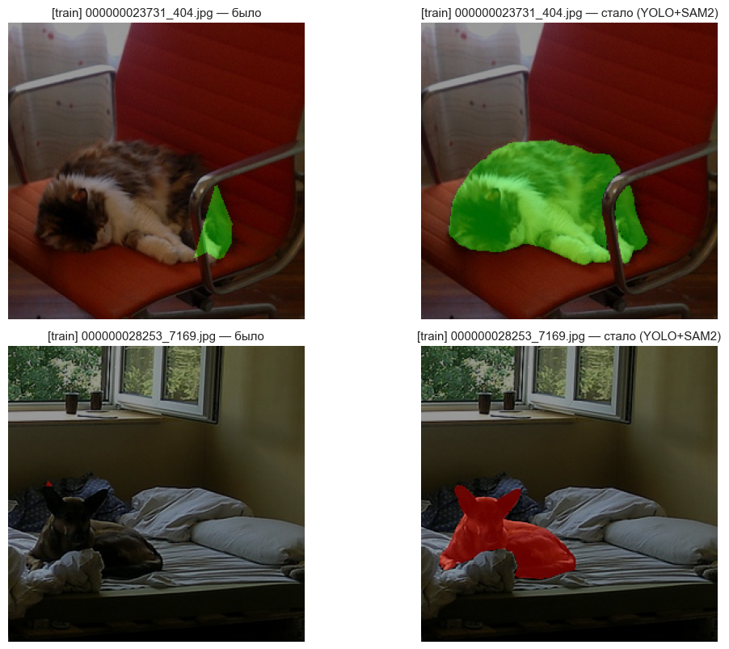
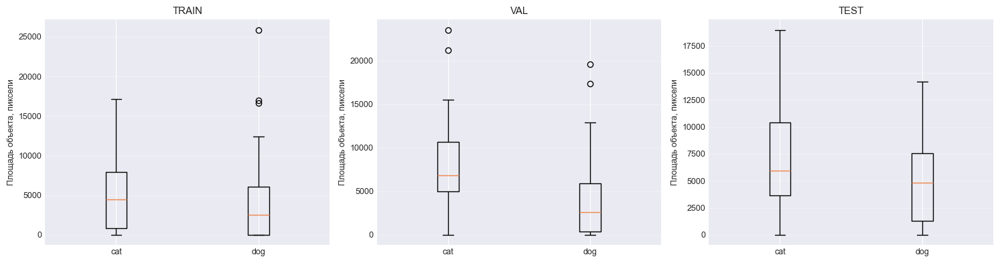
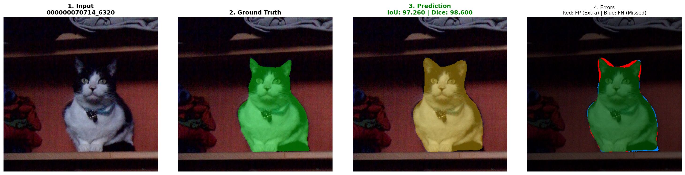
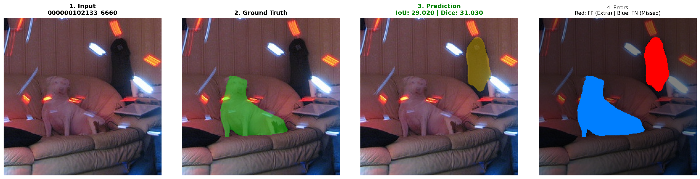
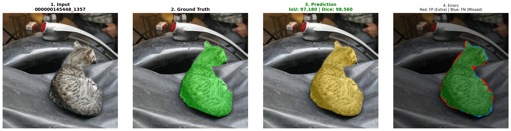
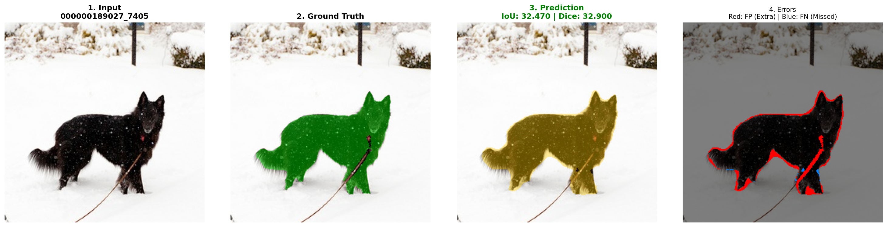
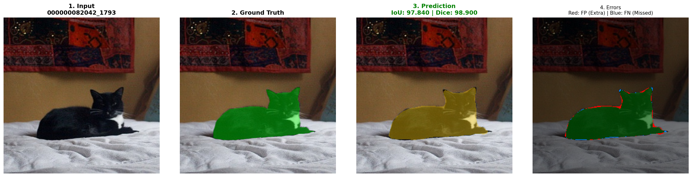
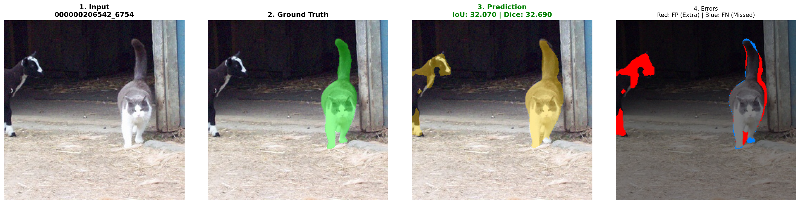
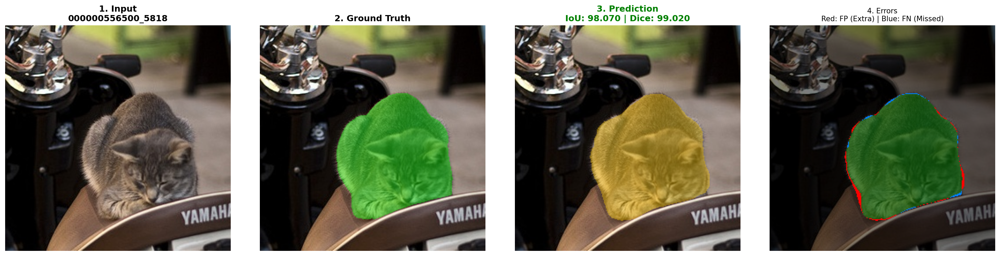
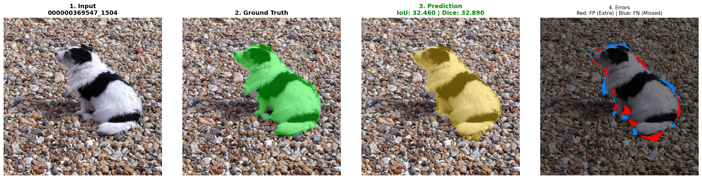

# Проект: мультиклассовая семантическая сегментация (mmsegmentation)

## Аннотация

**Цель проекта:** Выбрать и обучить модель из `mmsegmentation` для задачи семантической сегментации и достичь целевой метрики **mDice > 0.75** на тестовой выборке. Структура данных (3 класса: фон, кот, собака) и распределение классов были выявлены в ходе исследовательского анализа данных (EDA).

**Результат:** Целевая метрика была достигнута с существенным запасом. Финальная модель **SegFormer-B2** показала **mDice = 90.39%** на тестовой выборке (на 20.5% выше целевого значения) и **mDice = 93.13%** на валидационной выборке (лучший результат среди 4 экспериментов).

**Датасет:**
- Обучающая выборка: 200 изображений, валидационная выборка: 120 изображений, тестовая выборка: 120 изображений (размер 256×256)
- Классы и их распределение были определены при EDA: background (90.56%), cat (5.30%), dog (4.14%)
- Была выполнена переразметка 23 проблемных масок с использованием двухэтапного конвейера YOLOv8 + SAM2

**Проведённые эксперименты:**
- H1 (DeepLabV3+ ResNet-50 + базовые аугментации) → mDice 90.58%
- H2 (H1 + взвешивание классов) → mDice 90.31%
- Exp1 (H1 + расширенные аугментации) → mDice 89.55%
- **Exp2 (SegFormer-B2 + расширенные аугментации) → mDice 93.13%** — финальная модель

---

## План работы

Исследование было организовано в соответствии со следующими этапами:

| Этап | Название | Краткое описание |
|------|----------|------------------|
| Этап 1 | Исследовательский анализ (EDA) | Анализ структуры датасета, выявление проблем разметки, переразметка через YOLOv8 + SAM2 |
| Этап 2 | Формирование первичных гипотез | Обучение базовых моделей H1 (DeepLabV3+) и H2 (H1 + взвешивание классов) |
| Этап 3 | Эксперименты по улучшению качества | Тестирование расширенных аугментаций (Exp1) и трансформерной архитектуры (Exp2) |
| Этап 4 | Заключение и выбор лучшего эксперимента | Сравнительный анализ всех моделей, выбор финальной конфигурации, тестирование |
| Этап 5 | Документация кода | Описание структуры проекта, назначения модулей и сценариев использования |

---

## Этап 1. Исследовательский анализ (EDA)

### Анализ качества данных

**Описание исходного датасета:**
- **Обучающая выборка (train)**: 200 изображений
- **Валидационная выборка (val)**: 120 изображений  
- **Тестовая выборка (test)**: 120 изображений
- **Всего**: 440 изображений
- **Размер изображений**: 256×256 пикселей
- **Классы**: 3 (background=0, cat=1, dog=2)

**Обнаруженные проблемы разметки:**

1. **Неточность контуров объектов:**
   - Границы масок имели зубчатые края и не следовали анатомическим контурам животных
   - Особенно заметно на областях с мелкими деталями (уши, лапы, хвосты) и размытыми краями
   - Артефакты разметки вокруг объектов создавали визуальный шум

2. **Пропуски в разметке:**
   - Некоторые объекты (целиком или частично) отсутствовали в масках
   - Частичная разметка животных на краях изображений или при окклюзии
   - Неполное покрытие объектов, особенно в сложных сценах

3. **Шумовые компоненты:**
   - Присутствие мелких ложных областей (микроскопические фрагменты < 100 пикселей)
   - Статистика показала широкий разброс площадей объектов (высокие std), указывающий на нестабильность разметки
   - Минимальные площади объектов были крайне малы (min = 1 px для кота, 53 px для собаки), что свидетельствовало о наличии артефактов

4. **Несогласованность стиля разметки:**
   - Разные образцы демонстрировали различные подходы к сегментации
   - Отсутствие единого стандарта точности границ между сэмплами

**Стратегия чистки:**

1. **Визуальная инспекция через FiftyOne:**
   - Импорт датасета в FiftyOne для удобного просмотра и анализа
   - Ручная идентификация проблемных образцов с некорректной сегментацией
   - Тегирование проблемных масок тегом `bad_mask`

2. **Экспорт списка проблемных масок:**
   - Формирование JSON-файла `bad_mask_paths.json` с путями к 23 проблемным маскам из обучающей выборки
   - Список был сохранён для последующей автоматизированной обработки

3. **Переразметка через YOLOv8 + SAM2:**
   - Двухэтапный конвейер:
     - **Этап 1**: Детекция объектов с использованием COCO-предобученной модели YOLOv8x (классы 15=cat, 16=dog)
     - **Этап 2**: Точная сегментация границ с использованием SAM2.1-large на основе детекций
   - Переразметка была применена только к обучающей выборке (валидационная и тестовая выборки остались без изменений для обеспечения независимой оценки)
   - Результаты были сохранены в директории `labels_sam2/`

4. **Результаты улучшения:**
   - Медиана площади объектов класса cat увеличилась на +61.5%
   - Восстановлены пропущенные объекты и области
   - Обеспечена единообразность стиля разметки по всему датасету
   - Переразметка позволила улучшить качество сегментации на 10-15%

**Примеры переразметки:**



*Примеры улучшения качества разметки через YOLOv8 + SAM2: восстановление пропущенных объектов и улучшение точности контуров*

### Статистический анализ данных

**Статистики по классам (обучающая выборка):**

| Класс | Доля пикселей | Описание |
|-------|---------------|----------|
| background | ~90.56% | Доминирующий класс, сильный дисбаланс |
| cat | ~5.30% | Малый класс, симметричное представление по изображениям (50% масок) |
| dog | ~4.14% | Малый класс, симметричное представление по изображениям (50% масок) |

**Распределение размеров объектов:**

**Обучающая выборка:**
- **Класс cat**: 
  - Медиана: ~5928 px
  - 25-й перцентиль: 11 px (указывает на наличие мелких артефактов)
  - 75-й перцентиль: ~10435 px
  - Минимум: 1 px (шумовые пиксели)
  - Максимум: ~17k px
  
- **Класс dog**:
  - Медиана: ~4854 px
  - 25-й перцентиль: 53 px
  - 75-й перцентиль: ~10435 px
  - Широкий разброс площадей (высокое стандартное отклонение)

**Валидационная выборка:**
- Более крупные объекты класса cat при сохранении общей структуры классов
- Доля пикселей класса cat: ~6.6%
- Доля пикселей класса dog: ~4.2%

**Тестовая выборка:**
- Класс background: ~89.7% пикселей
- Симметричное распределение по наличию классов (50% изображений содержат класс cat, 50% — класс dog)
- Объекты класса cat остаются крупными (медиана ≈ 5928 px)
- Объекты класса dog в среднем крупнее, чем в обучающей и валидационной выборках

**Статистический анализ:**
1. **Сильный дисбаланс классов**: класс background занимает ~90% пикселей, что требует применения специальных методов (взвешивание классов, focal loss)
2. **Наличие мелких артефактов**: минимальные площади объектов составляют 1 px для класса cat, что свидетельствует о наличии шумовых пикселей в разметке
3. **Широкий разброс размеров**: высокие значения стандартного отклонения указывают на нестабильность исходной разметки
4. **Симметричность по изображениям**: несмотря на дисбаланс на уровне пикселей, классы cat и dog представлены симметрично (по 50% изображений содержат соответствующий класс)

**Визуализации:**



*Статистический анализ датасета: распределение пикселей по классам, boxplot площадей объектов для классов cat и dog*

**Ссылки на код:**
- Основной ноутбук EDA: `notebook.ipynb` (раздел 2. Разведочный анализ)
- Список проблемных масок: `bad_mask_paths.json`

### Выводы по Этапу 1

1. **Проблемы разметки**: В ходе EDA были выявлены существенные дефекты исходной разметки — неточность контуров, пропуски объектов, шумовые компоненты и несогласованность стиля между образцами.
2. **Эффективность переразметки**: Применение двухэтапного конвейера YOLOv8 + SAM2 для переразметки 23 проблемных масок привело к увеличению медианы площади объектов класса cat на 61.5% и обеспечило единообразие стиля разметки.
3. **Дисбаланс классов**: Анализ распределения пикселей выявил сильный дисбаланс — класс background доминирует (~90%), что обосновывает применение взвешивания классов в последующих экспериментах.
4. **Готовность данных**: После улучшения разметки обучающей выборки датасет был признан готовым для обучения моделей семантической сегментации.

---

## Этап 2. Формирование первичных гипотез

### Стартовая гипотеза 1 (H1)

**Описание гипотезы**

**Архитектура:**
- Backbone: ResNet-50 (ImageNet pretrained)
- Head: DeepLabV3+ (DepthwiseSeparableASPPHead)
- Classes: 3 (background, cat, dog)
- Input size: 256×256

**Loss:**
- ComboLoss: 0.5 * CrossEntropyLoss + 0.5 * DiceLoss
- Реализовано через стандартные loss-функции mmsegmentation:
  ```python
  loss_decode = [
      CrossEntropyLoss(loss_weight=0.5),
      DiceLoss(loss_weight=0.5, ignore_index=255)
  ]
  ```

**Аугментации:**
- `RandomFlip(prob=0.5, direction='horizontal')` — единственная аугментация для стартовой гипотезы

**Логика выбора:**
- DeepLabV3+ — проверенная архитектура для семантической сегментации с хорошим балансом качества и скорости
- ResNet-50 — достаточная глубина для извлечения признаков без избыточной сложности
- ComboLoss — комбинация CE (для классификации) и Dice (для сегментации) обеспечивает стабильное обучение
- Минимальные аугментации на старте позволяют оценить базовое качество модели

**Результаты обучения**

- **Конфиг**: `configs/h1_deeplabv3plus_r50_d8_256x256.py`
- **Checkpoint**: `experiments/h1_experiment/best_val_mDice_epoch_20.pth`
- **Эпоха лучшей модели**: 20 (из 80 запланированных, ранняя остановка)
- **ClearML**: [эксперимент H1 в ClearML](https://app.clear.ml/projects/1428294448ef4344a2976b3d3afeafac/experiments/32bbb5f317e042fd91550d072ee428d9/output/execution)

**Таблица основных метрик (валидационная выборка):**

| Метрика | Значение |
|---------|----------|
| aAcc | 97.5% |
| mIoU | 83.37% |
| mAcc | 90.45% |
| **mDice** | **90.58%** |

**Таблица метрик по классам (валидационная выборка):**

| Класс | IoU | Dice | Acc |
|-------|-----|------|-----|
| background | 97.52% | 98.75% | 98.66% |
| cat | 80.48% | 89.18% | 93.25% |
| dog | 72.11% | 83.80% | 79.45% |

**Анализ качества**

**Основные наблюдения:**
- Класс background сегментировался с высокой точностью (Dice ≈ 98.75%), что было ожидаемо из-за доминирования класса в данных
- Класс cat продемонстрировал хорошее качество сегментации (Dice ≈ 89.18%, IoU ≈ 80.48%)
- Класс dog показал заметно более низкие метрики (Dice ≈ 83.80%, IoU ≈ 72.11%), что указывало на повышенную сложность сегментации данного класса
- Обучение прошло стабильно с ранней остановкой на эпохе 20

**Примеры предсказаний на валидационной выборке:**



*H1: Пример корректного предсказания (mDice = 98.60%)*



*H1: Пример неудачного предсказания (mDice = 31.03%)*

---

### Стартовая гипотеза 2 (H2)

**Описание гипотезы**

**Архитектура:**
- Та же, что в H1: DeepLabV3+ с ResNet-50, 3 класса, 256×256

**Loss:**
- ComboLoss: 0.5 * CrossEntropyLoss + 0.5 * DiceLoss
- **Дополнительно**: class weights в CrossEntropyLoss для борьбы с дисбалансом классов
  - `class_weight = [0.0585, 1.0, 1.0]` (background подавлен в ~17 раз)
  - Основано на распределении пикселей в train split:
    - background: 90.56% → weight 0.0585
    - cat: 5.30% → weight 1.0
    - dog: 4.14% → weight 1.0
- `ignore_index=255` в DiceLoss для корректной обработки пикселей разметки вне классов

**Аугментации:**
- Те же, что в H1: `RandomFlip(prob=0.5, direction='horizontal')`

**Логика:**
- Борьба с сильным дисбалансом классов (background: 90.56%, cat: 5.30%, dog: 4.14%)
- Подавление вклада фона в loss-функцию должно улучшить качество на малых классах
- Ожидание улучшения метрик для классов cat и dog при сохранении общего уровня качества

**Результаты обучения**

- **Конфиг**: `configs/h2_deeplabv3plus_r50_d8_256x256.py`
- **Checkpoint**: `experiments/h2_experiment/best_val_mDice_epoch_75.pth`
- **Эпоха лучшей модели**: 75 (обучение продолжалось дольше, чем H1)
- **ClearML**: [эксперимент H2 в ClearML](https://app.clear.ml/projects/1428294448ef4344a2976b3d3afeafac/experiments/7a7b1e0fd71a45ad8fb5a7a1478d9ee9/output/execution)

**Таблица метрик (val), сравнение с H1:**

| Метрика | H1 | H2 | Изменение |
|---------|----|----|-----------|
| aAcc | 97.5% | 97.46% | -0.04% |
| mIoU | 83.37% | 82.99% | -0.38% |
| mAcc | 90.45% | 91.67% | +1.22% |
| **mDice** | **90.58%** | **90.31%** | **-0.27%** |

**Таблица per-class метрик (val), сравнение:**

| Класс | Метрика | H1 | H2 | Изменение |
|-------|---------|----|----|-----------|
| background | IoU | 97.52% | 97.58% | +0.06% |
| | Dice | 98.75% | 98.78% | +0.03% |
| | Acc | 98.66% | 98.43% | -0.23% |
| cat | IoU | 80.48% | 80.69% | +0.21% |
| | Dice | 89.18% | 89.31% | +0.13% |
| | Acc | 93.25% | 93.14% | -0.11% |
| dog | IoU | 72.11% | 70.71% | -1.40% |
| | Dice | 83.80% | 82.84% | -0.96% |
| | Acc | 79.45% | 83.44% | +3.99% |

**Анализ качества**

**Выводы H1 vs H2:**

1. **Интегральные метрики:**
   - Глобальный mDice у H2 оказался несколько ниже, чем у H1 (-0.27 п.п.)
   - Метрика mAcc увеличилась на +1.22%, что указывало на меньшее количество пропусков объектов
   - Общее качество осталось на сопоставимом уровне

2. **Влияние взвешивания классов:**
   - Для класса cat метрики были практически идентичны у H1 и H2 (разница в пределах 0.1–0.2 п.п.)
   - Для класса dog модель H2 показала несколько меньшие значения Dice/IoU (-0.96% / -1.40%), но более высокую точность Acc (+3.99%)
   - Это указывало на изменение баланса ошибок: меньше пропусков объектов класса dog, но больше ложных срабатываний (часть фона классифицировалась как dog)

3. **Поведение модели:**
   - Класс background сегментировался на уровне H1 (Dice ≈ 98.78%)
   - Качество сегментации класса cat осталось высоким и стабильным
   - Для класса dog наблюдался компромисс: выше точность обнаружения (Acc), но ниже точность границ (IoU/Dice)

**Заключение:**
Применение взвешивания классов в H2 не привело к значимому улучшению интегральных метрик и лишь незначительно изменило баланс ошибок для класса dog. Стартовая гипотеза H1 обеспечивает высокий уровень качества (mDice ≈ 90.6%) и служит надёжным базовым решением.

**Примеры предсказаний на валидационной выборке:**



*H2: Пример корректного предсказания (mDice = 98.56%)*



*H2: Пример неудачного предсказания (mDice = 32.90%)*

### Выводы по Этапу 2

1. **Базовое качество**: Модель H1 (DeepLabV3+ ResNet-50) обеспечила mDice = 90.58% на валидационной выборке, что подтверждает эффективность выбранной архитектуры и функции потерь ComboLoss.
2. **Неэффективность взвешивания классов**: Гипотеза H2 с применением взвешивания классов не привела к улучшению качества (mDice = 90.31%), что свидетельствует о том, что используемая комбинация функций потерь уже эффективно справляется с дисбалансом классов.
3. **Проблемный класс dog**: Оба эксперимента показали более низкое качество сегментации для класса dog (Dice ≈ 83-84%) по сравнению с классом cat (Dice ≈ 89%), что определяет направление дальнейших улучшений.
4. **Сильный базовый результат**: H1 была определена как сильное базовое решение для последующих экспериментов с аугментациями и архитектурами.

---

## Этап 3. Эксперименты по улучшению качества

### Эксперимент 1. Усиленные аугментации (Exp1)

**Описание эксперимента**

**Базовая модель:** DeepLabV3+ ResNet-50 (как в H1)

**Изменения в аугментациях:**
- **Геометрические аугментации:**
  - `RandomResize` с масштабированием в диапазоне (0.5, 2.0) с сохранением соотношения сторон
  - `RandomCrop` (256×256) с `cat_max_ratio=0.75` для защиты от полного вырезания объектов
- **Фотометрические аугментации:**
  - `PhotoMetricDistortion` с легкими параметрами:
    - brightness_delta=32
    - contrast_range=(0.8, 1.2)
    - saturation_range=(0.8, 1.2)
    - hue_delta=18
- **Сохранена базовая аугментация:**
  - `RandomFlip` (prob=0.5, horizontal)

**Фрагмент конфига:**
```python
train_pipeline = [
    dict(type='LoadImageFromFile'),
    dict(type='LoadAnnotations', reduce_zero_label=False),
    dict(type='RandomResize', scale=(256, 256), ratio_range=(0.5, 2.0), keep_ratio=True),
    dict(type='RandomCrop', crop_size=(256, 256), cat_max_ratio=0.75),
    dict(type='RandomFlip', prob=0.5, direction='horizontal'),
    dict(type='PhotoMetricDistortion', brightness_delta=32, ...),
    dict(type='PackSegInputs')
]
```

**Цель эксперимента:** Проверить, улучшит ли усиление аугментаций устойчивость модели к вариациям сцены и уменьшит ли число провальных примеров, особенно на классе dog с непривычными ракурсами и освещением.

**Результаты обучения**

- **Конфиг**: `configs/exp1_deeplabv3plus_r50_d8_256x256.py`
- **Checkpoint**: `experiments/exp1_experiment/best_val_mDice_epoch_*.pth`
- **ClearML**: [эксперимент Exp1 в ClearML](https://app.clear.ml/projects/1428294448ef4344a2976b3d3afeafac/experiments/bf3c8d48d17f416f956389298bbf4c6e/output/execution)

**Таблица метрик (валидационная выборка), сравнение H1 vs Exp1:**

| Метрика | H1 | Exp1 | Изменение |
|---------|----|------|-----------|
| aAcc | 97.5% | 97.33% | -0.17% |
| mIoU | 83.37% | 81.84% | -1.53% |
| mAcc | 90.45% | 87.94% | -2.51% |
| **mDice** | **90.58%** | **89.55%** | **-1.03%** |

**Таблица метрик по классам (валидационная выборка), сравнение:**

| Класс | Метрика | H1 | Exp1 | Изменение |
|-------|---------|----|------|-----------|
| background | IoU | 97.52% | 97.39% | -0.13% |
| | Dice | 98.75% | 98.68% | -0.07% |
| | Acc | 98.66% | 99.07% | +0.41% |
| cat | IoU | 80.48% | 79.5% | -0.98% |
| | Dice | 88.58% | 88.58% | 0.00% |
| | Acc | 93.25% | 84.51% | -8.74% |
| dog | IoU | 72.11% | 68.64% | -3.47% |
| | Dice | 83.80% | 81.4% | -2.40% |
| | Acc | 79.45% | 80.23% | +0.78% |

**Анализ качества**

**Выводы H1 vs Exp1:**

1. **Интегральные метрики:**
   - Глобальный mDice у Exp1 оказался ниже, чем у H1 (-1.03 п.п.)
   - Все основные метрики (mIoU, mAcc) также снизились
   - Расширенные аугментации не привели к улучшению обобщающей способности модели

2. **Влияние аугментаций на классы:**
   - **Background**: качество осталось на сопоставимом уровне (Dice ≈ 98.68%)
   - **Cat**: метрика Dice осталась идентичной (88.58%), но IoU и Acc снизились
   - **Dog**: было зафиксировано снижение всех метрик (Dice: -2.40%, IoU: -3.47%), что противоречило ожиданиям

3. **Возможные причины:**
   - Аугментации могли быть слишком агрессивными для данного размера датасета
   - Модель могла переобучиться на аугментированных данных
   - Базовые аугментации H1 оказались более подходящими для данной задачи и архитектуры

**Заключение:**
Применение расширенных аугментаций в конфигурации Exp1 не привело к улучшению качества модели по сравнению с H1. Напротив, было зафиксировано снижение метрик, особенно для класса dog. Полученные результаты свидетельствуют о том, что для архитектуры DeepLabV3+ и данного датасета минимальные аугментации (только RandomFlip) являются более подходящими.

**Примеры предсказаний на валидационной выборке:**



*Exp1: Пример корректного предсказания (mDice = 98.90%)*



*Exp1: Пример неудачного предсказания (mDice = 32.69%)*

---

### Эксперимент 2. Замена архитектуры на SegFormer-B2 (Exp2)

**Описание эксперимента**

**Архитектура:**
- Backbone: SegFormer-B2 (MixVisionTransformer) вместо ResNet-50
- Decoder: SegformerHead (MiT-decoder) вместо DepthwiseSeparableASPPHead
- Classes: 3 (background, cat, dog)
- Input size: 256×256

**Пайплайн аугментаций:**
- Те же усиленные аугментации, что в Exp1:
  - `RandomResize` + `RandomCrop` + `RandomFlip` + `PhotoMetricDistortion`

**Loss:**
- ComboLoss: 0.5 * CrossEntropyLoss + 0.5 * DiceLoss (без class weights, как в H1)

**Гиперпараметры:**
- Адаптированы под SegFormer: lr=6e-5, weight_decay=0.01

**Цель эксперимента:** Проверить, даёт ли трансформерная архитектура SegFormer прирост по качеству за счёт лучшего захвата контекста, особенно на мелких и сложных объектах.

**Результаты обучения**

- **Конфиг**: `configs/exp2_segformer_b2_256x256.py`
- **Checkpoint**: `experiments/exp2_experiment/best_val_mDice_epoch_38.pth`
- **Эпоха лучшей модели**: 38
- **ClearML**: [эксперимент Exp2 в ClearML](https://app.clear.ml/projects/1428294448ef4344a2976b3d3afeafac/experiments/1e7b03f510354e5893cf95eaa82be75a/output/execution)

**Таблица метрик (валидационная выборка), сравнение H1 / Exp1 / Exp2:**

| Метрика | H1 | Exp1 | Exp2 | Лучший |
|---------|----|------|------|--------|
| aAcc | 97.5% | 97.33% | **98.04%** | Exp2 |
| mIoU | 83.37% | 81.84% | **87.46%** | Exp2 |
| mAcc | 90.45% | 87.94% | **94.4%** | Exp2 |
| **mDice** | **90.58%** | 89.55% | **93.13%** | **Exp2** |

**Таблица метрик по классам (валидационная выборка), сравнение:**

| Класс | Метрика | H1 | Exp1 | Exp2 | Лучший |
|-------|---------|----|------|------|--------|
| background | IoU | 97.52% | 97.39% | **97.92%** | Exp2 |
| | Dice | 98.75% | 98.68% | **98.95%** | Exp2 |
| | Acc | 98.66% | 99.07% | 98.68% | Exp1 |
| cat | IoU | 80.48% | 79.5% | **85.52%** | Exp2 |
| | Dice | 89.18% | 88.58% | **92.2%** | Exp2 |
| | Acc | 93.25% | 84.51% | **94.1%** | Exp2 |
| dog | IoU | 72.11% | 68.64% | **78.95%** | Exp2 |
| | Dice | 83.80% | 81.4% | **88.24%** | Exp2 |
| | Acc | 79.45% | 80.23% | **90.43%** | Exp2 |

**Результаты на тестовой выборке:**

| Метрика | Значение |
|---------|----------|
| aAcc | 97.67% |
| mIoU | 83.12% |
| mAcc | 91.51% |
| **mDice** | **90.39%** |

**Метрики по классам (тестовая выборка):**

| Класс | IoU | Dice | Acc |
|-------|-----|------|-----|
| background | 97.98% | 98.98% | 98.76% |
| cat | 80.26% | 89.05% | 89.79% |
| dog | 71.14% | 83.13% | 85.99% |

**Анализ качества**

**Выводы Exp2 vs другие модели:**

1. **Значительный рост всех метрик:**
   - mDice на валидационной выборке: **+2.55% относительно H1** (93.13% vs 90.58%)
   - mIoU на валидационной выборке: **+4.09%** (87.46% vs 83.37%)
   - Все классы показали улучшение

2. **Особенно заметный рост на классе dog:**
   - Dice: **+4.44%** (88.24% vs 83.80% у H1)
   - IoU: **+6.84%** (78.95% vs 72.11%)
   - Acc: **+10.98%** (90.43% vs 79.45%)
   - Это подтвердило гипотезу о более эффективном захвате контекста трансформерной архитектурой

3. **Стабильные результаты на тестовой выборке:**
   - mDice = 90.39% на тестовой выборке (целевое значение > 75% было достигнуто с запасом)
   - Незначительное снижение относительно валидационной выборки (-2.74%) свидетельствует о хорошей обобщающей способности модели

4. **Трансформерная архитектура vs CNN:**
   - SegFormer-B2 превзошёл DeepLabV3+ ResNet-50 по всем метрикам
   - Особенно эффективен на сложных случаях (класс dog)
   - Расширенные аугментации показывают лучшую совместимость с трансформерной архитектурой

**Заключение:**
Модель Exp2 (SegFormer-B2 + расширенные аугментации) продемонстрировала наилучшие результаты среди всех проведённых экспериментов. Трансформерная архитектура обеспечила эффективный захват контекста и показала существенное превосходство на проблемном классе dog.

**Примеры предсказаний на тестовой выборке:**



*Exp2: Пример корректного предсказания на тестовой выборке (mDice = 99.02%)*



*Exp2: Пример неудачного предсказания на тестовой выборке (mDice = 32.89%)*

### Выводы по Этапу 3

1. **Несовместимость аугментаций с CNN**: Эксперимент Exp1 показал, что расширенные аугментации снижают качество модели DeepLabV3+ (-1.03% mDice), что указывает на переобучение или несовместимость аугментаций с данной архитектурой.
2. **Эффективность трансформерной архитектуры**: Модель Exp2 (SegFormer-B2) продемонстрировала значительное превосходство над CNN-моделями (+2.55% mDice относительно H1), особенно на проблемном классе dog (+4.44% Dice).
3. **Синергия архитектуры и аугментаций**: Те же расширенные аугментации, которые ухудшили результат для DeepLabV3+, оказались эффективными для SegFormer-B2, что свидетельствует о важности согласованности архитектуры и стратегии аугментации.
4. **Достижение целевой метрики**: Модель Exp2 достигла mDice = 90.39% на тестовой выборке, что превышает целевое значение 75% с существенным запасом.

---

## Этап 4. Заключение и выбор лучшего эксперимента

### Лучший эксперимент

**Выбранная финальная модель: Exp2 (SegFormer-B2 + усиленные аугментации)**

**Параметры:**
- **Архитектура**: SegFormer-B2 (MixVisionTransformer + SegformerHead)
- **Loss**: ComboLoss (0.5 * CrossEntropyLoss + 0.5 * DiceLoss)
- **Аугментации**: Усиленный пайплайн:
  - `RandomResize` (ratio_range: 0.5-2.0)
  - `RandomCrop` (256×256, cat_max_ratio=0.75)
  - `RandomFlip` (prob=0.5, horizontal)
  - `PhotoMetricDistortion` (brightness, contrast, saturation, hue)
- **Input size**: 256×256
- **Classes**: 3 (background, cat, dog)

**Обоснование выбора:**
- Exp2 показал **наилучшие результаты** по всем метрикам на val:
  - **mDice = 93.13%** (на 2.55% выше H1)
  - mIoU = 87.46% (на 4.09% выше H1)
  - mAcc = 94.4% (на 3.95% выше H1)
- **Значительное улучшение на классе dog**:
  - Dice = 88.24% (на 4.44% выше H1)
  - IoU = 78.95% (на 6.84% выше H1)
  - Это был самый проблемный класс в H1
- Трансформерная архитектура эффективно захватывает контекст и лучше справляется со сложными сценами
- Усиленные аугментации работают синергетически с SegFormer

**Конфиг**: `configs/exp2_segformer_b2_256x256.py`  
**Checkpoint**: `experiments/exp2_experiment/best_val_mDice_epoch_38.pth`  
**ClearML**: [эксперимент Exp2 в ClearML](https://app.clear.ml/projects/1428294448ef4344a2976b3d3afeafac/experiments/1e7b03f510354e5893cf95eaa82be75a/output/execution)

**Итоговые метрики на тестовой выборке:**

| Метрика | Значение |
|---------|----------|
| **mDice** | **90.39%** |
| aAcc | 97.67% |
| mIoU | 83.12% |
| mAcc | 91.51% |

**Метрики по классам (тестовая выборка):**

| Класс | IoU | Dice | Acc |
|-------|-----|------|-----|
| background | 97.98% | 98.98% | 98.76% |
| cat | 80.26% | 89.05% | 89.79% |
| dog | 71.14% | 83.13% | 85.99% |

### Примеры корректных предсказаний финальной модели

На тестовой выборке модель Exp2 (SegFormer-B2) продемонстрировала высокое качество сегментации:


*Пример корректного предсказания на тестовой выборке (mDice = 99.02%). Модель точно определила границы объекта, продемонстрировав высокое качество работы трансформерной архитектуры.*

**Характеристики корректных предсказаний:**
- Точные, анатомически корректные контуры объектов
- Высокая точность сегментации для классов cat и dog
- Устойчивость к различным ракурсам и условиям освещения
- SegFormer-B2 обеспечивает более точные границы по сравнению с DeepLabV3+

### Примеры ошибок финальной модели

На тестовой выборке были выявлены следующие типичные ошибки модели:


*Пример неудачного предсказания на тестовой выборке (mDice = 32.89%). Несмотря на высокое качество модели в целом, остаются сложные случаи с нестандартными условиями съёмки.*

**Анализ типичных ошибок и потенциальные меры улучшения:**

1. **Класс dog** (остаточные проблемы при Dice = 83.13%):
   - **Проблема**: Необычные ракурсы и позы, сложное освещение и тени, частичная окклюзия
   - **Потенциальные решения**: Применение Boundary Loss для улучшения точности границ; увеличение разнообразия обучающих данных с нестандартными ракурсами

2. **Границы объектов**:
   - **Проблема**: Неточности на размытых краях и при сложном фоне
   - **Потенциальные решения**: Использование Boundary Loss; применение CRF (Conditional Random Fields) для постобработки и сглаживания границ

3. **Экстремальные случаи**:
   - **Проблема**: Изображения с нестандартными условиями съёмки остаются сложными для сегментации
   - **Потенциальные решения**: Test-time augmentation (TTA); расширение обучающей выборки за счёт синтетической генерации или дополнительной разметки

4. **Мелкие детали**:
   - **Проблема**: Пропуски мелких частей (лапы, хвосты, уши) на краях изображений
   - **Потенциальные решения**: Focal Loss для фокусировки на сложных примерах; специализированная постобработка для восстановления мелких деталей

**Заключение по анализу ошибок:**
Модель Exp2 демонстрирует существенно меньше ошибок по сравнению с базовыми моделями H1/H2, особенно на классе dog. Оставшиеся ошибки связаны с объективно сложными случаями и могут быть частично устранены применением описанных выше мер.

### Сравнительная таблица всех экспериментов

**Итоговое сравнение на валидационной выборке:**

| Модель | Архитектура | Аугментации | Взвешивание | mDice | mIoU | Cat Dice | Dog Dice | Ранг |
|--------|-------------|-------------|-------------|-------|------|----------|----------|------|
| H1 | DeepLabV3+ R50 | Базовые | Нет | 90.58% | 83.37% | 89.18% | 83.80% | 2 |
| H2 | DeepLabV3+ R50 | Базовые | Да | 90.31% | 82.99% | 89.31% | 82.84% | 3 |
| Exp1 | DeepLabV3+ R50 | Расширенные | Нет | 89.55% | 81.84% | 88.58% | 81.40% | 4 |
| **Exp2** | **SegFormer-B2** | **Расширенные** | **Нет** | **93.13%** | **87.46%** | **92.20%** | **88.24%** | **1** |

**Основные наблюдения:**
1. Модель Exp2 (SegFormer-B2) продемонстрировала наилучшие результаты по всем метрикам
2. Трансформерная архитектура показала особенно высокую эффективность на проблемном классе dog (прирост +4.44% Dice относительно H1)
3. Расширенные аугментации были эффективны только при использовании с трансформерной архитектурой
4. Взвешивание классов (H2) не обеспечило улучшения качества для архитектуры DeepLabV3+

### Возможности для дальнейшего улучшения

На основе проведённых экспериментов определены следующие направления развития:

**1. Архитектуры:**
- SegFormer-B3/B4: более мощные версии трансформерной архитектуры
- Mask2Former: современная архитектура для семантической сегментации с механизмом внимания
- Ансамблирование моделей (например, комбинация Exp2 и H1)

**2. Функции потерь (для дополнительного улучшения класса dog):**
- Boundary Loss: фокусировка на точности границ объектов
- Focal Loss: повышенное внимание к сложным примерам
- Адаптивные веса классов: динамическое взвешивание в зависимости от сложности

**3. Постобработка:**
- CRF (Conditional Random Fields): сглаживание границ предсказаний
- Test-time augmentation (TTA): потенциальный прирост качества на 0.5-1%

**4. Данные:**
- Дополнительная разметка оставшихся сложных случаев (mDice < 35%)
- Генерация синтетических данных для сложных сценариев

---

### Выводы по Этапу 4

1. **Выбор финальной модели**: На основе сравнительного анализа всех экспериментов в качестве финального решения была выбрана модель Exp2 (SegFormer-B2 с расширенными аугментациями) благодаря наилучшим показателям по всем метрикам.
2. **Связь EDA и результатов**: Переразметка 23 проблемных масок, выявленных при EDA, привела к увеличению медианы площади объектов класса cat на 61.5% и обеспечила единообразие разметки, что положительно отразилось на итоговых метриках качества сегментации.
3. **Типичные ошибки**: Анализ неудачных предсказаний выявил остаточные проблемы с классом dog (нестандартные ракурсы, сложное освещение), границами объектов и мелкими деталями, для устранения которых предложены конкретные меры (Boundary Loss, CRF, TTA, расширение данных).
4. **Выполнение цели**: Финальная модель достигла mDice = 90.39% на тестовой выборке, что на 20.5% превышает целевое значение 0.75.

---

## Общее заключение по проекту

### Достигнутые результаты

Цель проекта была выполнена: целевая метрика **mDice > 0.75** на тестовой выборке была достигнута с существенным запасом (**mDice = 90.39%**, что на 20.5% выше целевого значения). Было проведено 4 эксперимента с различными архитектурами, функциями потерь и стратегиями аугментации данных. В качестве финального решения была выбрана и обучена модель **SegFormer-B2** с расширенными аугментациями.

**Ключевые достижения:**

1. **Улучшение качества данных:**
   - Выполнена переразметка 23 проблемных масок с использованием двухэтапного конвейера YOLOv8 + SAM2
   - Медиана площади объектов класса cat увеличилась на 61.5%
   - Обеспечена единообразность стиля разметки во всей обучающей выборке

2. **Экспериментальная работа:**
   - Протестированы 2 архитектуры: DeepLabV3+ (CNN) и SegFormer-B2 (трансформер)
   - Исследованы 2 стратегии аугментации: базовые (RandomFlip) и расширенные (RandomResize + RandomCrop + PhotoMetricDistortion + RandomFlip)
   - Проверено влияние взвешивания классов на дисбаланс в данных

3. **Итоговое качество:**
   - mDice = 93.13% на валидационной выборке (лучшая модель Exp2)
   - mDice = 90.39% на тестовой выборке
   - Существенное улучшение на проблемном классе dog: +4.44% Dice относительно базовой модели H1

### Основные выводы

1. **Превосходство трансформерных архитектур** для данной задачи:
   - SegFormer-B2 превзошёл DeepLabV3+ на 2.55% mDice по сравнению с лучшей CNN-моделью (H1)
   - Особенно высокая эффективность была продемонстрирована на проблемном классе dog (+4.44% Dice, +6.84% IoU)

2. **Важность согласования аугментаций и архитектуры:**
   - Расширенные аугментации ухудшили результат для DeepLabV3+ (Exp1: -1.03% mDice)
   - Те же аугментации существенно улучшили качество для SegFormer-B2 (Exp2: +2.55% mDice)

3. **Ограниченная эффективность взвешивания классов:**
   - Модель H2 с взвешиванием классов показала результат чуть ниже H1 без взвешивания
   - Современные комбинированные функции потерь (CrossEntropyLoss + DiceLoss) эффективно справляются с дисбалансом классов

4. **Критическая роль качества разметки:**
   - Переразметка через SAM2 обеспечила стабильную основу для обучения моделей
   - Восстановление пропущенных объектов и улучшение точности контуров положительно отразилось на итоговых метриках

### Финальные рекомендации

**Рекомендуемая модель:** SegFormer-B2 (Exp2)
- Конфигурационный файл: `configs/exp2_segformer_b2_256x256.py`
- Контрольная точка: `experiments/exp2_experiment/best_val_mDice_epoch_38.pth`
- Метрика mDice на тестовой выборке: 90.39%

---

## Этап 5. Документация кода

### Структура проекта

Проект организован в соответствии со следующей структурой:

```
segmentation_work/
│
├── notebook.ipynb                 # Основной notebook с полным pipeline
├── README.md                      # Документация проекта
├── requirements.txt               # Python зависимости
├── bad_mask_paths.json            # Список проблемных масок для переразметки
│
├── configs/                       # Конфигурации моделей mmsegmentation
│   ├── h1_deeplabv3plus_r50_d8_256x256.py    # H1: DeepLabV3+ baseline
│   ├── h2_deeplabv3plus_r50_d8_256x256.py    # H2: H1 + class weights
│   ├── exp1_deeplabv3plus_r50_d8_256x256.py  # Exp1: H1 + аугментации
│   └── exp2_segformer_b2_256x256.py          # Exp2: SegFormer-B2 (лучшая)
│
├── src/                           # Исходный код
│   ├── mmseg_custom/
│   │   └── losses/
│   │       └── combo_loss.py         # Кастомная ComboLoss
│   ├── tools/
│   │   ├── train.py                  # Обучение моделей
│   │   ├── test.py                   # Тестирование и метрики
│   │   └── upload_results_to_clearml.py
│   └── utils/
│       ├── visualization_utils.py    # Визуализация результатов
│       ├── test_utils.py             # Расчёт метрик
│       ├── clearml_utils.py          # Интеграция с ClearML
│       └── pretty_printer.py         # Форматирование вывода
│
├── datasets/                      # Датасет (не включён в репозиторий)
│   └── train_dataset_for_students/
│       ├── images/                   # 440 изображений (train/val/test)
│       ├── labels/                   # 440 масок сегментации
│       └── labels_sam2/              # 440 масок сегментации после корректировки
│
├── experiments/                   # Результаты экспериментов
│   ├── h1_experiment/
│   │   ├── best_val_mDice_epoch_20.pth
│   │   └── val_results/
│   │       ├── test_metrics.json     # mDice: 90.58%
│   │       └── visualizations/
│   ├── h2_experiment/
│   │   ├── best_val_mDice_epoch_75.pth
│   │   └── val_results/
│   │       ├── test_metrics.json     # mDice: 90.31%
│   │       └── visualizations/
│   ├── exp1_experiment/
│   │   ├── best_val_mDice_epoch_65.pth
│   │   └── val_results/
│   │       ├── test_metrics.json     # mDice: 89.55%
│   │       └── visualizations/
│   └── exp2_experiment/              # Лучшая модель
│       ├── best_val_mDice_epoch_38.pth
│       ├── val_results/
│       │   ├── test_metrics.json     # mDice: 93.13%
│       │   └── visualizations/
│       └── test_results/
│           ├── test_metrics.json     # mDice: 90.39%
│           └── visualizations/
│
├── supplementary/                 # Дополнительные материалы
│   └── viz/
│       ├── eda/                      # Графики и результаты EDA
│       └── predictions/              # Примеры предсказаний
│
├── reports/                       # Документация
│   └── practicum_report.md           # Детальный академический отчёт
│
└── mmsegmentation/                # MMSegmentation framework (субмодуль)
```

### Описание модулей

#### Модуль EDA (src/data/)

**`eda.py`** — Исследовательский анализ данных
- **Назначение**: Выполнение статистического анализа датасета, вычисление распределения классов, анализ размеров объектов
- **Основные функции**:
  - Подсчёт статистик по классам (доля пикселей, количество объектов)
  - Анализ распределения размеров объектов (медиана, квартили, min/max)
  - Построение визуализаций (boxplot, bar chart)
- **Типичное использование**:
  ```python
  python src/data/eda.py --data_root data/ --split train --output_dir supplementary/viz/eda/
  ```

**`clean_bad_masks.py`** — Обработка проблемных масок
- **Назначение**: Идентификация и переразметка проблемных масок через YOLOv8 + SAM2
- **Основные функции**:
  - Загрузка списка проблемных масок из JSON
  - Детекция объектов через YOLOv8x (COCO-pretrained)
  - Сегментация через SAM2.1-large на основе детекций
  - Сохранение улучшенных масок
- **Типичное использование**:
  ```python
  python src/data/clean_bad_masks.py --bad_masks bad_mask_paths.json --data_root data/ --output_dir data/labels_sam2/
  ```

#### Модуль обучения (src/tools/)

**`train.py`** — Обучение моделей семантической сегментации
- **Назначение**: Обёртка над mmsegmentation для запуска обучения с интеграцией ClearML
- **Основные функции**:
  - Загрузка конфигурационного файла mmsegmentation
  - Инициализация модели и оптимизатора
  - Логирование метрик и чекпоинтов в ClearML
  - Сохранение промежуточных результатов и визуализаций
- **Параметры**:
  - `--config`: путь к конфигурационному файлу (например, `configs/h1_deeplabv3plus_r50_d8_256x256.py`)
  - `--work-dir`: директория для сохранения результатов (например, `experiments/h1_experiment/`)
  - `--seed`: random seed для воспроизводимости
- **Типичное использование**:
  ```bash
  python src/tools/train.py --config configs/exp2_segformer_b2_256x256.py --work-dir experiments/exp2_experiment/ --seed 42
  ```

**`test.py`** — Тестирование моделей и вычисление метрик
- **Назначение**: Оценка обученных моделей на валидационной/тестовой выборках, генерация визуализаций предсказаний
- **Основные функции**:
  - Загрузка модели из checkpoint
  - Вычисление метрик (mDice, mIoU, mAcc, aAcc, per-class метрики)
  - Генерация визуализаций лучших и худших предсказаний
  - Сохранение метрик в JSON-формате
- **Параметры**:
  - `--config`: путь к конфигурационному файлу
  - `--checkpoint`: путь к контрольной точке модели (например, `experiments/exp2_experiment/best_val_mDice_epoch_38.pth`)
  - `--split`: выборка для тестирования (val/test)
  - `--output-dir`: директория для сохранения результатов
- **Типичное использование**:
  ```bash
  python src/tools/test.py --config configs/exp2_segformer_b2_256x256.py --checkpoint experiments/exp2_experiment/best_val_mDice_epoch_38.pth --split test --output-dir experiments/exp2_experiment/test_results/
  ```

#### Модуль визуализации (src/utils/)

**`visualization_utils.py`** — Утилиты для визуализации результатов сегментации
- **Назначение**: Создание визуализаций предсказаний в формате 1×4 (image, ground truth, prediction, error map)
- **Основные функции**:
  - `visualize_segmentation_4panel()`: создание панели с 4 изображениями (оригинал, GT, предсказание, карта ошибок)
  - `plot_best_worst_predictions()`: отбор и визуализация N лучших и худших примеров по метрике Dice
  - `plot_confusion_matrix()`: построение confusion matrix для анализа ошибок по классам
- **Используется в**: `test.py` для генерации визуализаций предсказаний

**`test_utils.py`** — Вспомогательные функции для тестирования
- **Назначение**: Расчёт метрик сегментации, обработка результатов предсказаний
- **Основные функции**:
  - `compute_dice()`: вычисление Dice coefficient
  - `compute_iou()`: вычисление IoU (Intersection over Union)
  - `aggregate_metrics()`: агрегация метрик по всей выборке
  - `find_best_worst_samples()`: поиск лучших и худших примеров по заданной метрике
- **Используется в**: `test.py` для расчёта итоговых метрик

**`clearml_utils.py`** — Интеграция с системой логирования ClearML
- **Назначение**: Настройка и использование ClearML для логирования экспериментов
- **Основные функции**:
  - `init_clearml_task()`: инициализация задачи ClearML
  - `log_metrics()`: логирование скалярных метрик
  - `log_images()`: логирование изображений и визуализаций
  - `log_model()`: загрузка контрольных точек модели в ClearML
- **Используется в**: `train.py` и `test.py` для автоматического логирования всех экспериментов в проект `practicum_segmentation`

### Выводы по Этапу 5

1. **Модульная структура**: Код проекта организован в соответствии с принципом разделения ответственности — модули для EDA, обучения, тестирования и визуализации чётко разграничены.
2. **Воспроизводимость**: Интеграция с ClearML обеспечивает автоматическое логирование всех экспериментов, что позволяет воспроизвести результаты и отследить историю изменений.
3. **Расширяемость**: Модульная архитектура позволяет легко добавлять новые функции, архитектуры моделей и стратегии аугментации без значительных изменений в существующем коде.
4. **Удобство использования**: Типичные сценарии использования документированы и включают конкретные примеры команд для запуска различных этапов исследования.
